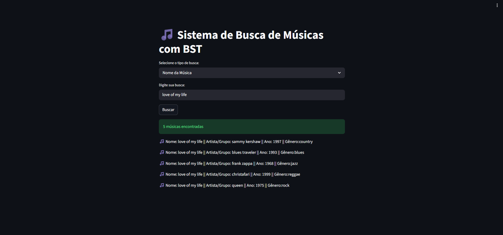

# G11-Busca-2026-01

**Número da Lista**: 11<br>
**Conteúdo da Disciplina**: Algoritmos de Busca<br>

## Alunos
|Matrícula | Aluno |
| -- | -- |
| 22/1007706  |  Elias Faria de Oliveira |
| ? | ? |

Projeto acadêmico para organização e busca de músicas utilizando uma **Árvore Binária de Busca (BST)**.

O sistema carrega um dataset com músicas, cria uma árvore com base no nome da música e no artista, e permite buscas por:

- nome da música;
- nome da música + artista;
- artista.

---

## Dataset utilizado

O dataset utilizado no projeto foi baixado do Kaggle:

[Music Dataset 1950 to 2019](https://www.kaggle.com/datasets/saurabhshahane/music-dataset-1950-to-2019/data)

O arquivo CSV está salvo em [assets/tcc_ceds_music.csv](assets/tcc_ceds_music.csv).

---

## Visão geral

O objetivo do projeto é demonstrar como uma BST pode ser usada para armazenar dados e recuperar informações de forma organizada.

Neste projeto:

- cada música é representada por um objeto da classe `music`;
- a BST guarda esses objetos em nós;
- a ordenação é feita por **nome da música** e, em caso de empate, por **artista**;
- as buscas estão configuradas para correspondência **exata**, priorizando desempenho e consistência.

---

## Estrutura do projeto

```text
main.py
README.md
assets/
	tcc_ceds_music.csv
models/
	Music.py
services/
	lecture_dataset.py
structures/
	BST.py
```

### Arquivos principais

- `main.py`: interface da aplicação em Streamlit.
- `models/Music.py`: classe que representa uma música.
- `services/lecture_dataset.py`: leitura e transformação do dataset.
- `structures/BST.py`: implementação da árvore binária de busca.

---

## Como o projeto funciona

### 1. Leitura do dataset

O arquivo `services/lecture_dataset.py` lê o CSV `assets/tcc_ceds_music.csv` com `pandas` e transforma cada linha em uma tupla:

```python
(id, name, artist, genre, year)
```

Essa tupla é usada para criar um objeto `music`.

### 2. Inserção na BST

Cada objeto `music` é inserido na árvore.

O critério de ordenação usado é:

1. nome da música;
2. artista;
3. se não for menor, o valor é inserido à direita.

### 3. Busca

A BST oferece buscas com correspondência exata:

- `search_music(name)`: busca músicas cujo nome seja exatamente igual ao informado;
- `search_music(name, artist)`: busca músicas cujo nome e artista sejam exatamente iguais aos informados;
- `search_by_artist(artist)`: busca músicas cujo artista seja exatamente igual ao informado.

---

## Aplicação



## Link da Gravação

[Gravação](https://youtu.be/xPTlW5xn-eg)

## Explicação da árvore binária de busca

Uma **Árvore Binária de Busca** é uma estrutura hierárquica em que:

- cada nó pode ter no máximo dois filhos;
- os valores menores ficam à esquerda;
- os valores maiores ficam à direita.

### No contexto deste projeto

O valor do nó não é um número, mas sim um objeto `music`.

Para decidir onde inserir, o sistema compara uma chave formada por:

```python
(nome_da_musica, artista)
```

Essa comparação é feita de forma case-insensitive, usando `casefold()` e `strip()`.

### Exemplo de inserção

Se a árvore já possui a música:

- `Imagine` - `John Lennon`

E você insere:

- `Billie Jean` - `Michael Jackson`

Como `Billie Jean` vem antes de `Imagine`, ela será posicionada na subárvore esquerda.

Se o nome for igual, o artista passa a ser o critério de desempate.

---

## Interface da aplicação

A interface foi construída com **Streamlit**.

Na tela principal, o usuário pode escolher o tipo de busca:

- Nome da Música
- Nome da Música + Artista
- Artista

Depois basta digitar o termo desejado e clicar em **Buscar**.

---

## Como rodar o projeto

### 1. Criar e ativar o ambiente virtual

```bash
python3 -m venv .venv
source .venv/bin/activate
```

### 2. Instalar as dependências

```bash
pip install pandas numpy streamlit
```

### 3. Executar a aplicação

```bash
streamlit run main.py
```

Se preferir usar diretamente o Python do ambiente virtual:

```bash
.venv/bin/python main.py
```

---

## Como usar

### Busca por nome da música

Digite o nome exato da música.

Exemplo:

```text
mohabbat bhi jhoothi
```

### Busca por nome da música + artista

Digite o nome e o artista exatos, separados por vírgula.

Exemplo:

```text
mohabbat bhi jhoothi, mukesh
```

### Busca por artista

Digite o nome exato do artista.

Exemplo:

```text
mukesh
```

---

## Observações importantes

- A busca atual usa comparação exata com `==`.
- `search_music()` retorna uma lista para manter a interface consistente, mesmo quando há apenas um resultado.
- A interface mostra apenas os primeiros resultados para não sobrecarregar a tela.
- O dataset possui muitas linhas, então a construção da árvore pode levar alguns segundos.

---

## Exemplo de saída

Ao buscar por `mohabbat bhi jhoothi`, o sistema retorna a música correspondente:

- `mohabbat bhi jhoothi`

---

## Tecnologias utilizadas

- Python
- Pandas
- NumPy
- Streamlit

---

## Autores

Projeto desenvolvido para fins acadêmicos na disciplina de Estrutura de Dados e Algoritmos.

